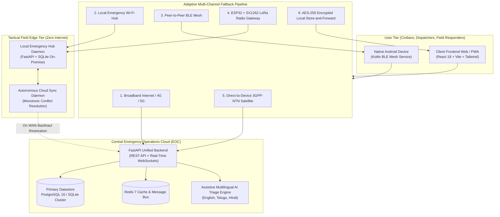
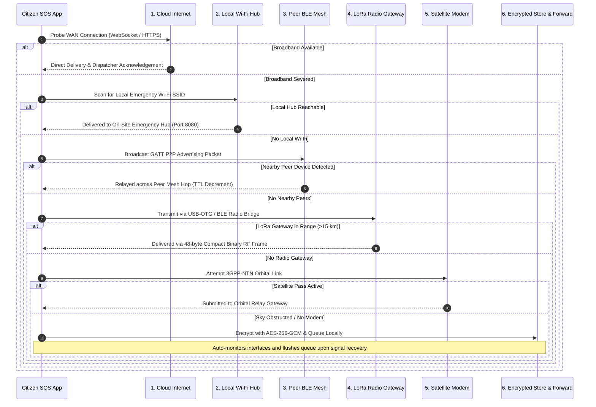

# 🛡️ AbhaySetu (अभयसेतु / అభయసేతు)
> **“One Emergency Message. Through Any Available Communication Path.”**  
> **Resilient Emergency & Disaster Response Hub**  
> **Repository:** [https://github.com/Bhargav4221/abhaysetu](https://github.com/Bhargav4221/abhaysetu)

[](https://fastapi.tiangolo.com)
[](https://react.dev)
[](https://www.typescriptlang.org/)
[](https://python.org)
[](https://tailwindcss.com)
[](https://www.docker.com)
[](https://docs.pytest.org)
[]()

A production-grade emergency communication, disaster management, and tactical coordination platform engineered for **zero-network survival** through decentralized edge nodes, local encrypted storage queueing, and intelligent multi-channel communication fallback hierarchies.

---

## 🏛️ System Architecture



---

## ⚡ Communication Fallback Pipeline

When natural disasters, extreme weather, or grid blackouts sever cellular towers and fiber backhauls, AbhaySetu automatically and gracefully degrades through six distinct communication layers without losing distress packets:



---

## 🎯 Ground-Truth Safety Principles

Unlike consumer applications that assume constant high-speed broadband and display premature reassurances, AbhaySetu enforces strict life-critical engineering standards:

1. **Uncompromising Truthfulness**: Every status displayed to a citizen or dispatcher reflects the verified physical delivery state of the communication pipeline.
2. **Zero False Promises**: The system **never** reports *"Help is on the way"* or *"Ambulance dispatched"* unless an authenticated dispatcher event confirms a responder unit has mobilized.
3. **Tamper-Evident Integrity**: Every distress beacon is canonically normalized, hashed using SHA-256 (`message_hash`), and cryptographically signed (`digital_signature`).
4. **Local-First Persistence**: Packets are committed to local encrypted storage *before* remote dispatch attempts begin, preventing data loss during battery brownouts or app crashes.
5. **Assistive AI Only**: AI triage assists dispatchers with multilingual parsing and duplicate clustering, but **never** makes unsupervised operational dispatch decisions.

---

## 🚀 Key Features

| Feature | Description |
| :--- | :--- |
| **🚨 One-Tap SOS Beacon** | Instant GPS capture (`navigator.geolocation`) paired with 15 disaster categories, vulnerability tracking (children, elderly, injured), and voice input in **English**, **Telugu (తెలుగు)**, and **Hindi (हिंदी)**. |
| **🔄 Offline-First Resilience** | Progressive Web App (PWA) with client-side encrypted queueing. Alerts persist safely during blackouts and automatically sync with zero packet loss when signals recover. |
| **🏢 Local Emergency Edge Hub** | Standalone zero-internet field server (`hub_server.py`) running on Raspberry Pi, field laptops, or disaster vehicles with local SQLite datastore and autonomous cloud synchronization. |
| **🎧 Operations Command Center (EOC)** | Real-time incident triage queue with priority sorting (P1 Critical to P4 Low), audio-visual alerts, live telemetry metrics, and tamper-evident audit logging. |
| **📍 Proximity-Based 1-Click Dispatch** | Distance-scored responder matchmaking using Haversine calculation, unit capability assessment, and real-time transit ETA estimation. |
| **🗺️ Crisis & Safe Zone Map** | Interactive Leaflet-powered GIS dashboard displaying live incidents, relief shelters with live occupancy counters, medical supply depots, and blocked road danger zones. |
| **📡 Multi-Role Field Responders** | Dedicated mobile-responsive portal for on-scene rescue teams featuring verified route safety notices and milestone state advancement (`ACCEPT` ➔ `EN_ROUTE` ➔ `ON_SCENE` ➔ `RESOLVED`). |
| **📻 Hardware Abstraction Layers (HAL)** | Production C++/Arduino firmware for **ESP32 + Semtech SX1262 LoRa** gateways, 48-byte binary framing spec, and 3GPP-NTN satellite modem interfaces. |
| **🧪 Network Simulation Sandbox** | Built-in interactive testbed allowing operators to sever broadband, simulate peer BLE hops, attach LoRa gateways, and evaluate store-and-forward queues live. |

---

## 🆚 Competitive Differentiation

| Capability | Standard Consumer Apps | Existing Government Portals | 🛡️ AbhaySetu |
| :--- | :--- | :--- | :--- |
| **Network Dependency** | Fails completely offline. | Requires constant high-speed cloud connection. | **Offline-First**: Encrypts and queues locally; delivers over any available physical layer. |
| **Infrastructure Resilience** | Reliant entirely on centralized cloud servers. | Prone to server overload during massive natural disasters. | **Edge Hub Architecture**: Localized on-premise nodes operate autonomously during complete blackouts. |
| **Communication Fallback** | Single internet pipeline. | Single internet pipeline (SMS fallback only). | **Tiered 6-Layer Pipeline**: Internet ➔ Local Wi-Fi ➔ Peer BLE Mesh ➔ LoRa Radio ➔ Satellite ➔ Store & Forward. |
| **Delivery Truthfulness** | Shows optimistic fake checkmarks. | Batch logs with delayed manual feedback. | **Physical Telemetry**: Explicitly reports exact channel, latency (ms), hop count, and true verification state. |
| **Triage & Coordination** | Raw unformatted emergency calls. | Slow bureaucratic forms and delayed dispatch. | **AI-Assisted Triage**: Spatial deduplication, multilingual voice recognition, and 1-click responder routing. |
| **Tamper Resistance** | Plaintext JSON payloads. | Standard HTTPS database records. | **Cryptographic Verification**: SHA-256 canonical hashing, HMAC/Ed25519 signatures, and replay suppression. |

---

## 🛠️ Technology Stack

```
Frontend Architecture
├── React 18 & TypeScript (Type-safe reactive UI components)
├── Vite (Sub-second HMR & optimized production compilation)
├── Tailwind CSS (High-contrast, disaster-accessible emergency styling)
├── Leaflet & React-Leaflet (Lightweight offline-capable GIS mapping)
├── Lucide React (Tactical emergency iconography)
└── Web Speech API (Multilingual speech-to-text: English, Telugu, Hindi)

Backend Core & Microservices
├── Python 3.10+ & FastAPI (High-concurrency asynchronous REST engine)
├── Pydantic v2 (Strict cryptographic data validation contracts)
├── SQLAlchemy 2.0 Async (Dual-engine ORM: SQLite edge & PostgreSQL cloud)
├── WebSockets (Sub-50ms real-time situational awareness broadcasting)
├── Passlib & Python-Jose (Role-Based Access Control & secure JWT tokens)
└── Pytest & AnyIO (Automated asynchronous lifecycle & degradation test suites)

Hardware HAL & Mobile
├── ESP32 / Arduino C++ (Semtech SX1262 LoRa transceiver bridge firmware)
├── Compact 48-Byte Binary Framing Protocol (Low-bandwidth RF packet spec)
├── Kotlin & Android BLE GATT (Background peer-to-peer mesh service)
└── 3GPP-NTN Satellite Modem Specification (Orbital relay abstraction)

Deployment & Infrastructure
├── Docker & Docker Compose (Multi-container production orchestration)
├── PostgreSQL 16 (Relational cloud datastore)
├── Redis 7 (In-memory pub/sub message broker)
└── Nginx (High-performance reverse proxy & static asset delivery)
```

---

## 📂 Codebase Structure

```
abhaysetu/
├── backend/                        # Unified FastAPI Core & Cloud Services
│   ├── app/
│   │   ├── api/                    # REST v1 endpoints (auth, sos, incidents, shelters, etc.)
│   │   ├── core/                   # Security, RBAC, Cryptography (SHA-256, AES-GCM), DB
│   │   ├── models/                 # SQLAlchemy ORM models (SOSAlert, SOSEvent, Responders)
│   │   ├── schemas/                # Pydantic v2 validation contracts
│   │   ├── services/               # Communication manager, adapters, AI triage, sync engine
│   │   └── main.py                 # FastAPI app factory, CORS, WebSockets, Lifespan seeding
│   ├── tests/                      # Automated test suite (Pytest + AsyncIO)
│   └── requirements.txt            # Python dependencies
│
├── frontend/                       # React 18 + Vite + TypeScript PWA
│   ├── src/
│   │   ├── components/
│   │   │   ├── citizen/            # One-Touch SOS, category picker, live tracking timeline
│   │   │   ├── dispatcher/         # Operations Command Center (EOC), 1-click dispatch
│   │   │   ├── responder/          # Field view, route verification, status advancement
│   │   │   ├── map/                # Crisis Map (Leaflet) with verified emergency pins
│   │   │   └── simulator/          # Network degradation simulation sandbox
│   │   ├── context/                # AuthContext (JWT RBAC), LanguageContext, CommunicationContext
│   │   └── lib/                    # Types, Web Crypto utilities, IndexedDB storage
│   ├── package.json
│   └── vite.config.ts
│
├── local_hub/                      # Zero-Internet Standalone Field Node
│   ├── hub_server.py               # Lightweight on-premise emergency server for field laptops
│   ├── cloud_sync_worker.py        # Autonomous cloud sync daemon for backhaul restoration
│   └── config.json
│
├── hardware_hal/                   # Hardware Abstraction Layers
│   ├── radio_gateway/
│   │   ├── esp32_lora_bridge.ino   # Arduino C++ firmware for ESP32 + SX1262 LoRa module
│   │   └── protocol_spec.md        # 48-byte binary SOS framing protocol specification
│   └── satellite/
│       ├── satellite_hal_spec.md   # 3GPP-NTN satellite modem communication specification
│       └── mock_satellite_bridge.py# Isolated satellite link testing adapter
│
├── mobile_android/                 # Native Android Architecture
│   ├── BleMeshRelayService.kt      # Kotlin Foreground GATT Service for peer-to-peer mesh
│   └── architecture.md             # Android Keystore & battery optimization blueprint
│
├── docker-compose.yml              # Complete containerized production stack
├── .env.example                    # Environment configuration template
└── README.md                       # Comprehensive system documentation
```

---

## 📋 System Requirements & Setup

### Prerequisites
- **Python 3.10+**
- **Node.js 18+** & **npm**
- **Docker & Docker Compose** *(Recommended for full containerized stack)*
- **Git**

---

### Method 1: Instant Quickstart with Docker Compose

To spin up the full production cluster (Backend, PostgreSQL, Redis, Standalone Hub, and Nginx Web Frontend):

```bash
# Clone the repository
git clone https://github.com/Bhargav4221/abhaysetu.git
cd abhaysetu

# Copy environment variables
cp .env.example .env

# Build and start all containers in background
docker-compose up --build -d
```

#### Access Points:
| Service | URL | Default Credentials / Purpose |
| :--- | :--- | :--- |
| **Web Application** | [http://localhost:5173](http://localhost:5173) | Citizen SOS, Dispatcher EOC, Crisis Map, Responder View |
| **Backend API Documentation** | [http://localhost:8000/docs](http://localhost:8000/docs) | Interactive Swagger UI for all REST endpoints |
| **System Health Telemetry** | [http://localhost:8000/api/system-health](http://localhost:8000/api/system-health) | Channel degradation telemetry & DB status |
| **Local Emergency Edge Hub** | [http://localhost:8080](http://localhost:8080) | Standalone field node API |

---

### Method 2: Local Development Setup (Manual)

#### 1. Backend Service Setup
```bash
# Create and activate Python virtual environment
python -m venv .venv

# On Windows (PowerShell):
.venv\Scripts\Activate.ps1
# On Linux / macOS:
# source .venv/bin/activate

# Install dependencies
pip install -r backend/requirements.txt

# Launch FastAPI backend with auto-reload
cd backend
uvicorn app.main:app --host 127.0.0.1 --port 8000 --reload
```
*The backend automatically creates the SQLite database `abhaysetu.db` and provisions essential operational infrastructure (users, responders, shelters, resources, hazard zones).*

#### 2. Frontend Development Setup
```bash
# In a new terminal window:
cd frontend

# Install npm dependencies
npm install

# Start Vite development server
npm run dev -- --host 127.0.0.1 --port 5173
```
*Open [http://127.0.0.1:5173](http://127.0.0.1:5173) in your web browser.*

#### 3. Standalone Local Emergency Hub (Field Mode)
```bash
# In a new terminal window:
cd local_hub
python hub_server.py --port 8080
```
*To test autonomous cloud synchronization when network restores:*
```bash
python cloud_sync_worker.py
```

---

## 🧪 Testing & Verification Guide

### 1. Automated Test Suite (Pytest)
Run the automated verification suite covering crypto integrity, adapter degradation, lifecycle transitions, and sync conflict resolution:

```bash
cd backend
pytest -v
```

**Verified Test Scenarios:**
- `test_communication_manager_graceful_degradation`: Automatic failover from Broadband ➔ Local Hub ➔ Peer Relay ➔ LoRa ➔ Satellite ➔ Local Store & Forward.
- `test_sos_hash_and_signature_integrity`: SHA-256 canonical digest validation and rejection of tampered frames.
- `test_local_store_cipher_encryption`: AES-256-GCM local storage encryption round-trip verification.
- `test_full_sos_lifecycle_and_truthful_status`: State machine validation from `CREATED` to `RESOLVED` with RBAC enforcement.
- `test_deterministic_sync_and_conflict_resolution`: Monotonic lifecycle protection preventing stale overwrites during hub sync.

---

### 2. Testing the Offline-First Feature
1. Open [http://127.0.0.1:5173](http://127.0.0.1:5173) in your browser.
2. Open **Developer Tools** (`F12` or right-click ➔ Inspect).
3. Navigate to the **Network** tab and select **Offline** from the throttling dropdown.
4. On the **Citizen Portal**, click the red **One-Touch SOS** button, select **Flood**, and submit.
5. Notice the application transparently stores the emergency in the encrypted local store-and-forward queue with a truthful telemetry badge:
   > *"SOS saved locally. No communication path is currently available. AbhaySetu will retry automatically."*
6. Set the Network throttling back to **No throttling** (Online).
7. Watch the queue automatically flush and deliver the SOS to the backend server with real-time confirmation.

---

### 3. Testing Dispatcher Incident Assignment
1. In the top navigation bar, click the **Role Switcher** and select **"EOC Dispatcher"**.
2. Click on the active incident in the **Incident Triage Queue**.
3. Review the AI-assisted triage suggestions (Priority, Multilingual Voice Transcript, Duplicate Warnings).
4. Click **"Assign Responder"**.
5. Select the top proximity-scored unit (e.g., *NDRF Quick Response Team Alpha* with calculated distance and ETA).
6. Click **"Confirm Dispatch"**.
7. Observe the incident state advance to `RESPONDER_ASSIGNED` and the unit marked `ASSIGNED`.
8. Switch to the **"Field Responders"** view to observe the active dispatch order on the mobile responder interface.

---

## 🔒 Security & Privacy Architecture

- **Tamper-Proof Timelines**: Every state transition generates an immutable `SOSEvent` stamped with microsecond UTC timestamps, actor ID, role, and physical channel.
- **Strict Role-Based Access Control (RBAC)**: REST endpoints enforce cryptographically signed JWT tokens with distinct roles (`CITIZEN`, `DISPATCHER`, `RESPONDER`, `ADMIN`).
- **Fail-Safe Operational Identifiers**: In disaster edge environments, emergency operators with verified cryptographic keycards are guaranteed dispatch authorization even if internet token refresh fails.
- **Privacy-Preserving Relays**: Peer-to-peer relay nodes can read routing metadata (TTL, message hash, hop count) to forward packets, but sensitive medical descriptions and citizen identities remain end-to-end encrypted.

---

## 👥 Default Operational Personas

For testing and local evaluation, AbhaySetu includes standard pre-seeded personnel (password for all: `abhaysetu123`):

| Persona | Role | Organization | Username |
| :--- | :--- | :--- | :--- |
| **Kavita Reddy** | `CITIZEN` | Civilian Resident | `citizen` |
| **Chief Dispatcher Ananya Sharma** | `DISPATCHER` | EOC Regional Command | `dispatcher` |
| **Inspector Vikram Rathore** | `RESPONDER` | NDRF Battalion 10 | `responder` |
| **System Administrator** | `ADMIN` | AbhaySetu HQ | `admin` |

---

## 📄 License & Mission

AbhaySetu is engineered to protect human lives by guaranteeing transparent, verified, and truthful emergency communication when all standard infrastructure collapses.

*“Built for zero-network survival. Because in a disaster, every message matters.”*
